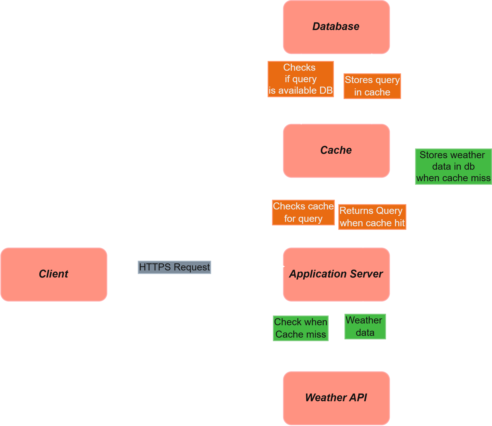
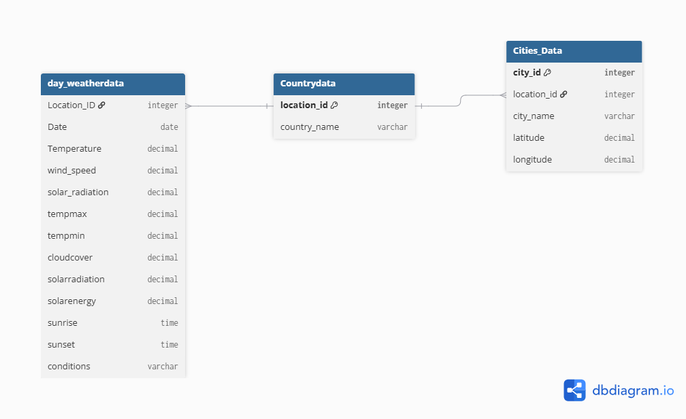

# Weather API Backend

This backend is a lightweight, Redis-backed weather API that combines **caching, LRU eviction, and rate limiting** to provide a fast and controlled data access layer.

## Highlights

- Weather requests are served through a **FastAPI** application.
- **Redis** is used for cache persistence and queue-based eviction.
- A custom **LRU-style eviction mechanism** keeps only the most relevant cache entries.
- A **cache-aside pattern** reduces repeated downstream API calls.
- A **token bucket rate limiter** protects the service from excessive request bursts.
- The system is optimized for repeated weather lookups across similar date and location combinations.

---

## Architecture

The project is structured around a simple request flow:

1. A request arrives at the weather endpoint.
2. The client IP is checked against the token bucket rate limiter.
3. A cache key is built from the location and date range.
4. The application checks Redis for a cached result.
5. If the result is missing, the application fetches fresh weather data from the external API.
6. The response is stored in Redis with a TTL.
7. The LRU tracking queue manages which keys remain in the active cache set.

---

## Database Design

---

## Cache Refresh Behavior

The cache follows a **cache-aside** approach:

1. If the weather data is already cached, it is returned immediately.
2. If the data is not cached, the backend fetches it from the upstream weather service.
3. The fetched result is stored in Redis for future requests.
4. Cache entries expire based on their **TTL**, helping keep data current without overloading the external provider.

## LRU Eviction

The backend includes an **LRU-style cache maintenance mechanism**:

- Recently accessed keys are tracked in a Redis list.
- Older cache keys are evicted when the queue exceeds the configured limit.
- This helps maintain a small, high-value working set of weather data in memory.

This is useful when the API is frequently queried for a limited subset of locations and date ranges.

## Rate Limiting

The application also includes a **Redis-backed token bucket rate limiter**:

- Each client IP receives a limited number of tokens.
- Tokens refill over time.
- Requests are denied once the bucket is empty.

This prevents abuse and helps protect both the backend and the upstream weather API from excessive request bursts.

## Why This Project Is Interesting

This project demonstrates a practical combination of:

- API development with **FastAPI**
- **Redis-based caching**
- **LRU-style eviction logic**
- Dynamic cache refresh
- Distributed rate control
- Efficient reuse of expensive external API data

It demonstrates practical backend engineering concepts for building a performant service that reduces repeated API calls, controls system load, and remains resilient under traffic spikes.

## Example Use Case

A user requesting the same weather forecast multiple times can benefit from:

- Faster response times
- Fewer upstream API calls
- Reduced latency
- Improved backend stability

## Technologies

- **Python**
- **FastAPI**
- **Redis**
- **External Weather API**
- **Token Bucket Rate Limiting**
- **LRU Cache Eviction**